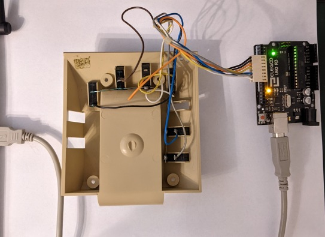

# Microwriter MW4 Emulator

The Microwriter MW4 was an innovative early hand held computing device
with a chording keyboard, first demonstrated in the late 1970's

* https://en.wikipedia.org/wiki/Microwriter 

Manuals for this device may be found here:

* https://www.microsoft.com/buxtoncollection/a/pdf/microwriter%20new%20users%20guide.pdf
* https://www.microsoft.com/buxtoncollection/a/pdf/Microwriter%20General%20Systems%20Manual.pdf

I own one of these devices and extracted the EPROM contents. This
repository contains a simple emulator for the Microwriter MW4 and some
additional tools.  If you have, or are able to construct, a microwriter
keyboard then you may connect that via a serial port and use the keyboard
to enter data. You will need an Arduino UNO R3, or similar. The code
for reading the keyboard is provided in this directory.

It is also possible to pass key codes to the emulator on the command line.

I contacted Chris Rainey (chris@bellaire.co.uk), co-inventor of the
Microwriter MW4 and he was kind enough to allow me to publish the EEPROM
image alongside this emulator.  Please note, this permission is granted
for non-commercial use only.

## Running the emulator

This emulator works under Linux, I'm using Debian Buster.

You will need the following packages:

    apt-get install build-essential picocom

A simple Makefile is used to build all of the components. The following 
builds the emulator:

    make microwriter

Perform an initial test, like this:

    ./microwriter -r microwriter.rom -d -c $(./text_to_codes hello world)

Your terminal should clear and then you should see the following:

    +            @            @@    @@                                  @@       @       @   @
    +      @     @             @     @                                   @       @       @@ @@
    +      @     @ @@   @@@    @     @    @@@        @   @  @@@  @ @@    @    @@ @       @ @ @
    +      @   @ @@  @ @   @   @     @   @   @       @   @ @   @ @@  @   @   @  @@       @   @
    +      @  @  @   @ @@@@@   @     @   @   @       @ @ @ @   @ @       @   @   @       @   @
    +      @ @   @   @ @       @     @   @   @       @ @ @ @   @ @       @   @   @       @   @
    +      @@    @   @  @@@   @@@   @@@   @@@         @ @   @@@  @      @@@   @@@        @   @
    +
    +
    +
    +@@@@@

As you can see, there are a number of flags on the command line. 

    -r microwriter.rom # The emulator opens the EEPROM image contained in microwriter.rom
    -d                 # Causes the emulator to send an embedded sequence of keys which force sensible defaults
    -c                 # Clear the screen every time a new display is rendered, otherwise the display scrolls

Any remaining arguments are treated as key code. The key codes are
hexadecimal patterns reflecting the pattern of keys on the chording
keyboard. Those patterns are summarised in a file called letters in
this directory. Some scripts have been provided which allow key codes to 
be generated easily, for example:

    [542]% ./text_to_codes hello
    0x11 0x08 0x19 0x19 0x04 0x10

It's convenient to embed that conversion on the command line (see initial
test, above).

The Microwriter manuals, reference above, describe command
sequences. These are used to control the state of the device and have a
dedicated key (positioned under the thumb at the bottom left hand side
of the keyboard). The command sequences are similar to letters but with 
the dedicated key depressed. An additional script has been provided to 
simplify command sequence entry. As an example, page 32 of the New User's 
guide describes a sequence of keys used to erase everything from the device.
The command sequence is shown as \[M\]\[W\]\[M\]\[K\] and the following command 
generates key codes for that:

    [38]% ./command $(./text_to_codes mwmk) ; echo
    0x2f 0x2b 0x2f 0x22 

Putting that into the emulator, like this:

    [39]% ./microwriter -r microwriter.rom -d -c 0x2f 0x2b 0x2f 0x22

Results in the following output:

    +@   @ @@@@@ @   @  @@@  @@@@  @   @        @@@  @     @@@@@  @@@  @@@@  @@@@@ @@@     @         
    +@@ @@ @     @@ @@ @   @ @   @ @   @       @   @ @     @     @   @ @   @ @     @  @    @         
    +@ @ @ @     @ @ @ @   @ @   @ @   @       @     @     @     @   @ @   @ @     @   @   @         
    +@   @ @@@@  @   @ @   @ @@@@   @ @        @     @     @@@@  @   @ @@@@  @@@@  @   @   @         
    +@   @ @     @   @ @   @ @ @     @         @     @     @     @@@@@ @ @   @     @   @             
    +@   @ @     @   @ @   @ @  @    @         @   @ @     @     @   @ @  @  @     @  @              
    +@   @ @@@@@ @   @  @@@  @   @   @          @@@  @@@@@ @@@@@ @   @ @   @ @@@@@ @@@     @         
    +                                                                                                
    +                                                                                                
    +                                                                                                
    +                                                                                                @@@@@
    +
    +

The memory has been cleared.

## Making and using the serial keyboard adapter

If you would like to make an interface to the keyboard using an Arduino,
the following instructions will help you to install the required tools.

* https://wiki.debian.org/Arduino

Connect your Arduino to a USB port on your computer and flash the
device. If your Arduino is not connected to /dev/ttyACM0 then you will
need to make appropriate adjustments to the Makefile. You may choose to
examine the output from the dmesg command in order to check the device
name for the Arduino.

    [560]% sudo make clean flash 
    rm -f serial_keyboard.hex serial_keyboard.elf serial_keyboard.o microwriter
    avr-gcc -Wall -Os -mmcu=atmega328p -c serial_keyboard.c -o serial_keyboard.o
    In file included from serial_keyboard.c:4:0:
    /usr/lib/avr/include/util/setbaud.h:222:4: warning: #warning "Baud rate achieved is higher than allowed" [-Wcpp]
     #  warning "Baud rate achieved is higher than allowed"
        ^
    avr-gcc -Wall -Os -mmcu=atmega328p -o serial_keyboard.elf serial_keyboard.o
    rm -f serial_keyboard.hex
    avr-objcopy -O ihex -R .eeprom serial_keyboard.elf serial_keyboard.hex
    gcc -Wall -Wextra -g microwriter.c display.c cdp1802.c -o microwriter
    avrdude -V -F -c arduino -p ATMEGA328P -b 115200 -P /dev/ttyACM0 -U flash:w:serial_keyboard.hex

    avrdude: AVR device initialized and ready to accept instructions

    Reading | ################################################## | 100% 0.00s

    avrdude: Device signature = 0x1e950f (probably m328p)
    avrdude: NOTE: "flash" memory has been specified, an erase cycle will be performed
             To disable this feature, specify the -D option.
    avrdude: erasing chip
    avrdude: reading input file "serial_keyboard.hex"
    avrdude: input file serial_keyboard.hex auto detected as Intel Hex
    avrdude: writing flash (288 bytes):

    Writing | ################################################## | 100% 0.06s

    avrdude: 288 bytes of flash written

    avrdude: safemode: Fuses OK (E:00, H:00, L:00)

    avrdude done.  Thank you.

Here are a couple of pictures of the keyboard setup:

You may want to test that this works correctly. If you connect using a
serial terminal, hitting the enter key on your computer keyboard will
trigger a scan of the Microwriter keyboard.

Here, I connect to the serial port and hit enter a few times while also
pressing keys on the Microwriter keyboard:

    [31]% sudo picocom -l /dev/ttyACM0 -b 115200 -q 
    110111
    111110
    111101
    111011
    110111
    101111
    011111

Before using the keyboard it is important to ensure that the baud rate
settings are correct. If you have picocom (see apt-get, above) then the
following command will do that:

    sudo picocom -l /dev/ttyACM0 -b 115200 -r -X -q

Now you can run the emulator like this and enter keys using the chording
keyboard:

    ./microwriter -r microwriter.rom -d -c -s

Press CTRL-C to exit. If that fails, try CTRL-Z and then kill the
background process.

## Known bugs

The cursor position looks wrong.

## Implementation notes

* cdp1802.c A simple emulator for the CDP1802/COSMAC processor. This is not coded efficiently but I tried to make the code map over the instruction table in this document http://www.qq22.net/qq22/pdf/1802.pdf
* display.c This is coded directly from the display controller data sheet below. Entering the pixel information was tedious.
* microwriter.c Glues the CDP1802 emulator to the display and contains the main program loop.
* serial_keyboard.c An Arduino program for reading the keyboard and sending key codes to the PC serial port.

## Resources

* The display controller https://datasheet.octopart.com/HD43160AH-Hitachi-datasheet-108301.pdf
* User manual for the CDP1802 http://bitsavers.trailing-edge.com/components/rca/cosmac/MPM-201A_User_Manual_for_the_CDP1802_COSMAC_Microprocessor_1976.pdf
* This is another, perhaps more efficient emulator for the CDP1802 https://github.com/wd5gnr/1802UNO
